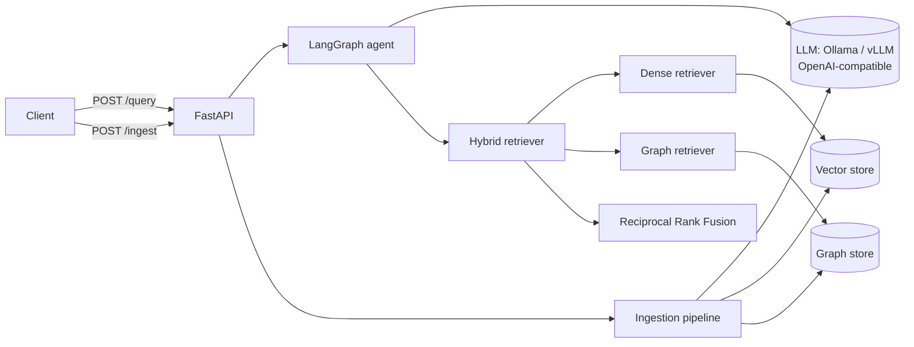
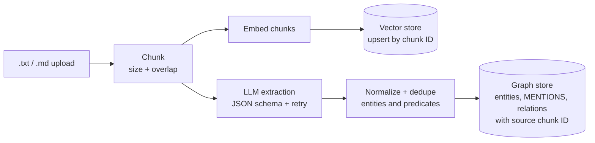
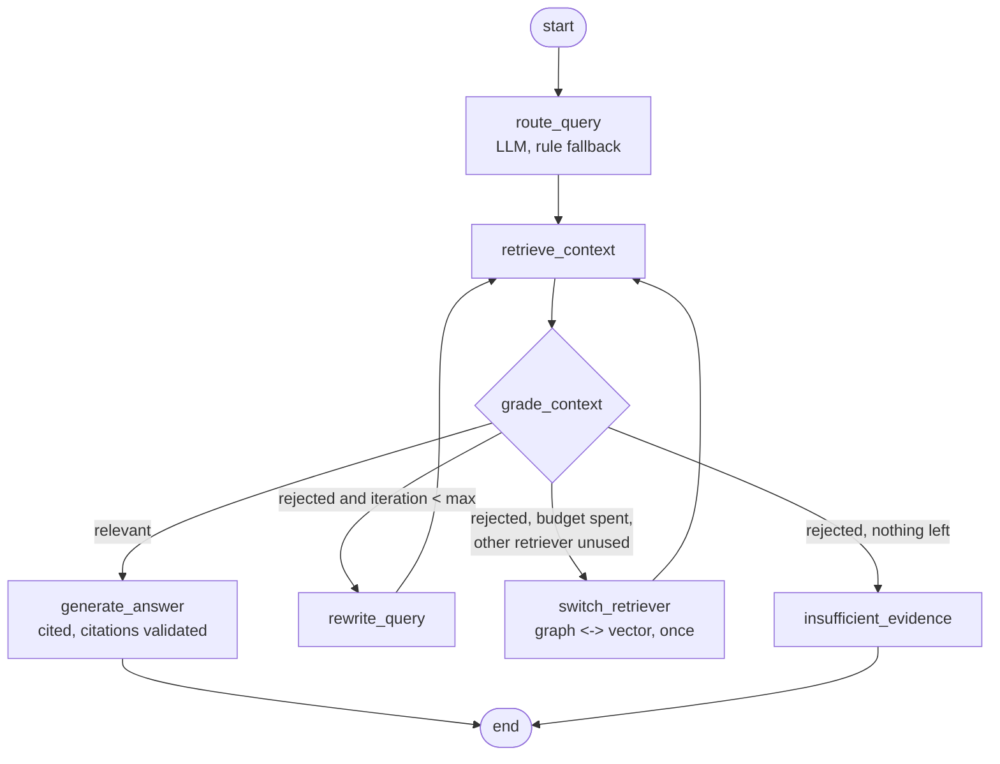

# Agentic GraphRAG

[](https://github.com/Adigit2211/agentic-graphrag/actions/workflows/ci.yml)
[](LICENSE)
[](pyproject.toml)

Hybrid **knowledge-graph + dense-vector retrieval** for multi-hop question answering,
orchestrated by a **LangGraph** agent and served by **FastAPI**, using a local
open-source LLM (Ollama by default, any OpenAI-compatible server works).

> **Status: v0.1.** The full pipeline works end to end, but the graph and vector
> stores are **in-memory**. Neo4j, Qdrant and a benchmark harness are on the
> [roadmap](#roadmap) and are *not* implemented yet. See [Limitations](#limitations).

## Why GraphRAG?

Plain vector search retrieves passages that *look like* the question. Multi-hop
questions such as *"Who founded the company that acquired Helix Robotics?"* need a
passage about the acquisition **and** one about the founder, and the second shares
little wording with the question. A knowledge graph links the entities across
documents, so the system can walk `Helix Robotics -> Aurora Labs -> Mira Chen` and
pull in the chunks that support each hop. Vector search still covers questions that
are answered by the wording of a single passage. This project fuses both.

## Architecture



### Ingestion flow



Chunk and entity IDs are deterministic hashes and every write is an upsert, so
re-ingesting the same file creates no duplicates.

### Agent state machine



Every node appends an event (node name, latency, decisions) to the `trace` returned
by the API.

## Quickstart

Requires Python 3.11+ and [Ollama](https://ollama.com/download).

```bash
git clone https://github.com/Adigit2211/agentic-graphrag.git && cd agentic-graphrag
python -m venv .venv && source .venv/bin/activate && make install
ollama pull llama3.1:8b          # in a separate terminal: `ollama serve` must be running
make run                         # API on http://localhost:8000 (docs at /docs)
make ingest-sample               # in a second terminal
```

Then ask a multi-hop question:

```bash
curl -s localhost:8000/query -H 'content-type: application/json' \
  -d '{"query": "Who founded the company that acquired Helix Robotics?"}'
```

The sample corpus (`data/sample/`) is **fictional** and tiny. It exists to demo the
mechanics, not to measure quality.

To run everything **offline without any model**, use `make test`: the LLM is replaced
by a scripted fake and embeddings by a deterministic hashing embedder.

## API

| Method | Path | Purpose |
|---|---|---|
| POST | `/query` | Answer a question |
| POST | `/ingest` | Upload `.txt` / `.md`; returns `202` and a job ID |
| GET | `/ingest/{job_id}` | Job status (`queued`, `running`, `done`, `failed`) |
| GET | `/health` | Per-component health; `503` if any component is down |

```bash
# ingest a file
curl -s -F "file=@data/sample/aurora_labs.md" localhost:8000/ingest
# {"job_id": "…", "status": "queued"}

# poll it
curl -s localhost:8000/ingest/<job_id>

# query with per-request options
curl -s localhost:8000/query -H 'content-type: application/json' \
  -d '{"query": "Where did the founder of Aurora Labs study?", "options": {"top_k": 3, "max_iterations": 1}}'

# health
curl -s localhost:8000/health
```

`/query` returns:

| Field | Meaning |
|---|---|
| `answer` | The answer, or an explicit "Insufficient evidence" message |
| `grounded` | `true` only if at least one valid citation survived validation |
| `insufficient_evidence` | `true` when the agent gave up or the model said it could not answer |
| `citations` | `{chunk_id, doc_id, text}` for each cited chunk (only IDs that were really retrieved) |
| `graph_context` | `nodes` and `edges` (with source chunk IDs) of the traversed sub-graph |
| `retrieved` | All fused chunks, each tagged `origin`: `graph`, `vector` or `both` |
| `trace` | Nodes visited, router decisions (`source: llm\|rules`), grader verdicts, per-node latency |

## Configuration

Set via environment variables or `.env` (see `.env.example`).

| Variable | Default | Description |
|---|---|---|
| `LLM_BASE_URL` | `http://localhost:11434/v1` | OpenAI-compatible endpoint (Ollama; point at vLLM to swap) |
| `LLM_MODEL` | `llama3.1:8b` | Model name sent to the endpoint |
| `LLM_API_KEY` | `ollama` | Bearer token (ignored by Ollama) |
| `LLM_TIMEOUT_S` | `120` | Per-request LLM timeout |
| `EMBEDDER` | `sentence-transformers` | `sentence-transformers` or `hashing` (lexical, offline) |
| `EMBEDDING_MODEL` | `BAAI/bge-small-en-v1.5` | sentence-transformers model |
| `CHUNK_SIZE` / `CHUNK_OVERLAP` | `800` / `100` | Characters per chunk / overlap |
| `EXTRACTION_MAX_RETRIES` | `2` | Re-asks after invalid extraction JSON |
| `MAX_UPLOAD_BYTES` | `5000000` | Upload size limit |
| `TOP_K` | `5` | Chunks returned after fusion |
| `GRAPH_HOPS` | `2` | Traversal depth (max 3) |
| `GRAPH_ENTITY_LIMIT` | `50` | Cap on entities reached in one traversal |
| `RRF_K` | `60` | RRF damping constant |
| `MAX_ITERATIONS` | `2` | Max query rewrites before fallback |
| `QUERY_TIMEOUT_S` | `180` | Overall `/query` timeout (returns 504) |

## Benchmark results

**No benchmark has been run.** The evaluation harness (HotpotQA subset, four
configurations, MLflow logging) is not implemented in v0.1, so this table is
intentionally empty. Numbers will be added only after they are produced by the
script, together with the exact command, seed, hardware and model versions.

| Configuration | Exact Match | F1 | Recall@k | Latency |
|---|---|---|---|---|
| vector-only | TBD | TBD | TBD | TBD |
| graph-only | TBD | TBD | TBD | TBD |
| hybrid (RRF) | TBD | TBD | TBD | TBD |
| hybrid + agentic loop | TBD | TBD | TBD | TBD |

`tests/unit/test_pipeline_and_gold.py` contains a three-question regression test on
the fictional sample corpus. It guards the wiring of the pipeline. It is **not** a
quality measurement.

## Design decisions and trade-offs

Full write-up in [docs/design-decisions.md](docs/design-decisions.md). Highlights:

- **Protocols before backends.** Stores and clients sit behind `typing.Protocol`s, so
  v0.1 runs with zero infrastructure and Neo4j/Qdrant can be added without touching
  retrieval or agent code. Trade-off: no persistence yet.
- **Deterministic graph retrieval.** Entity linking is a whole-phrase match and
  traversal is a bounded BFS. No LLM-written query language, so nothing to inject
  into. Trade-off: no fuzzy or alias matching.
- **Reciprocal Rank Fusion** avoids calibrating cosine scores against hop distances.
- **A bounded, tested agent loop.** Rewrites are capped, fallback happens at most
  once, and the end state is an honest "insufficient evidence".
- **LLM output is never trusted.** Router, grader and rewriter fall back to rules on
  bad output; hallucinated citations are dropped and `grounded` says so.
- **No LangChain.** `langgraph` plus `httpx` only.

## Verification status

What was actually run (Python 3.13 sandbox, before publishing):

- `pytest`: 86 tests pass (chunking, extraction parsing/retry, normalization, RRF,
  graph store, router fallback, grader-loop termination, full LangGraph runs, LLM
  client against a mock transport, API via httpx `AsyncClient`).
- `ruff`, `black --check`, `mypy --strict`: clean.
- Real `uvicorn` startup with no LLM running: `/health` returns 503 with
  per-component detail, `/query` on an empty index returns "insufficient evidence",
  and an ingest job fails with a clear error.

**Not yet verified**, so treat with care and report problems:

- A live run against Ollama (the OpenAI-compatible client is only tested against a
  mock transport; JSON-mode behaviour and extraction quality depend on the model).
- The `sentence-transformers` download path.
- `docker compose up` (the Docker files are provided but untested).
- CI on Python 3.11 / 3.12 (tests were run on 3.13 locally).

## Limitations

- **In-memory stores.** Data is lost on restart; one process only. Ingest job state
  is also in memory.
- **No Neo4j or Qdrant yet**, and therefore no Cypher templates or read-only graph
  role. These are v0.2 work.
- **No query decomposition and no cross-encoder reranker.**
- **`.txt` and `.md` only.** PDFs are rejected with HTTP 415.
- **Entity linking is exact phrase match** on normalized names: no aliases
  ("Aurora" vs "Aurora Labs"), no coreference resolution.
- **Extraction quality depends on a small local model**, and extraction runs
  sequentially, so large corpora are slow.
- **"Grounded" means valid citations, not verified faithfulness.** The grader is a
  relevance judgement plus a rule fallback; there is no semantic faithfulness check.
- **Re-ingesting a *changed* file** adds the new chunks but does not remove stale
  ones.
- **No authentication or rate limiting** on the API.
- **The hashing embedder is lexical only**; it exists for tests and offline smoke
  runs.
- **No performance or accuracy claims** are made anywhere in this repository.

## Roadmap

1. **v0.2:** Neo4j graph store (vetted parameterized Cypher, read-only session),
   Qdrant vector store, and `docker-compose` with both.
2. **v0.3:** Benchmark harness on a HotpotQA subset (EM, F1, recall@k, latency) with
   MLflow tracking; results table filled from real runs.
3. Query decomposition, optional cross-encoder reranking, PDF loading, a vLLM compose
   profile.

## Project layout

```
app/         FastAPI app, config, schemas, routes
ingestion/   chunker, extractor, normalizer, loaders, pipeline, jobs
graph/       models, deterministic IDs, graph store (in-memory)
retrieval/   embeddings, dense, graph, fusion, hybrid retriever
agent/       LangGraph state, nodes, router rules, grading, workflow
llm/         OpenAI-compatible client, JSON extraction helpers
scripts/     ingest_sample.py
data/sample/ fictional demo corpus + gold questions
tests/       unit + API tests
docs/        design decisions
```

## Development

```bash
make format && make lint && make typecheck && make test
```

See [CONTRIBUTING.md](CONTRIBUTING.md). Licensed under [MIT](LICENSE).
